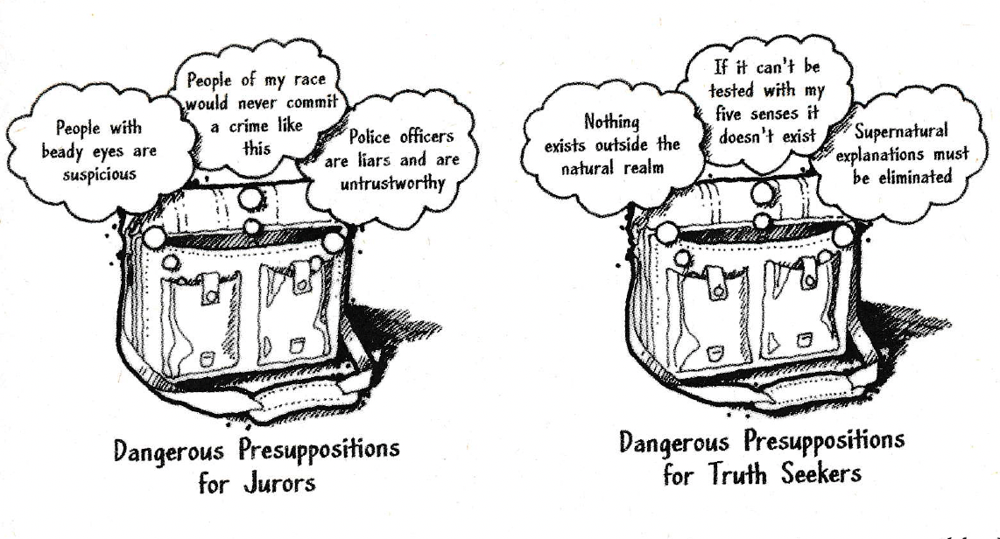

# Cold Case Christianity - Lesson 1

## Page 11

## Page 12

* Strengths - What is explains
* Weaknesses - What it doesn't explain

| Explanation                                 | Strengths                                                     | Weaknesses                                                                                 |
|---------------------------------------------|---------------------------------------------------------------|--------------------------------------------------------------------------------------------|
| Jesus didn't really die on the cross        | empty tomb, resurrection observations, apostle transformation | pericardial effusion, pleural effusion, guards subject to death, fully healed after 3 days |
| The disciples lied about the Resurrection   | empty tomb, resurrection observations                         | tomb guarded, locals would know of the lie, no motive, disciples transformation            |
| The disciples hallucinated the Resurrection | resurrection experiences                                      | no large group hallucinations, not sustained, sightings diverse, no body                   |
| The Resurrection truly occurred             | empty tomb, resurrection observations, apostle transformation | belief in supernatural                                                                     |

