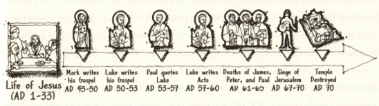
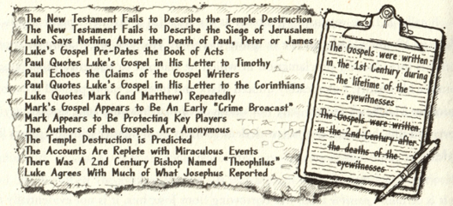

## Cold Case Christianity - Were They Present

### Page 59

### Summary Points

### References

- [Cold Case Christianity Website](http://www.coldcasechristianity.com/)
- Wallace, J Warner. [*Cold-Case Christianity: A Homicide Detective Investigates the Claims of the Gospels*](https://www.amazon.com/Cold-Case-Christianity-Updated-Expanded-Investigates/dp/0830785302/ref=sr_1_1?crid=2BNS25EFI1OP5&dib=eyJ2IjoiMSJ9.4BYw5fChhn4B2MedCvplrCe-BQIq7P-i3_KCbZczEAdAdG7Qu1xfMeXUncQAchXu-2OZ3oShefX6dbNOtYi3w_bxu9_8-Coi6r8oJuci46XD33MyyciX__jWJa8gSfM5mIYVawOlhGlhcEq6Sa51e3iA8aFulEeeLX9_V2u-jeN21EfvbOrjIdBTNIrnWasTy41IzSv1ZZZ48dBwAHOCqg7FdCwW6UJs8FaiSB18hSM.YLCgOhNusANiUvOvjk44Wl4UVYmm0-qoz48Bm4B7_AI&dib_tag=se&keywords=cold+case+christianity+by+j.+warner+wallace&qid=1710001778&sprefix=cold+case%2Caps%2C153&sr=8-1). Colorado Springs: David C. Cook, 2013, 2023. Print.